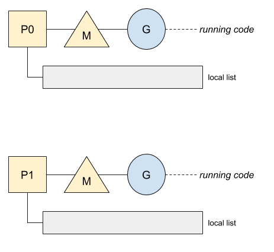
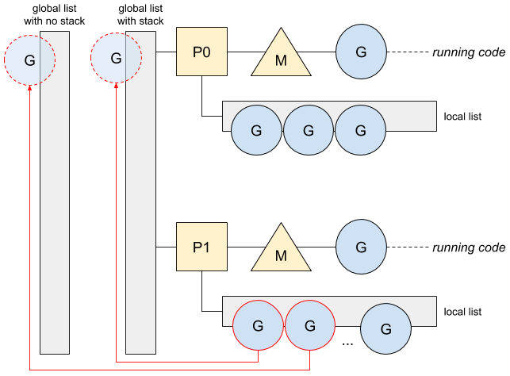

# Go: Goroutine 的回收机制

ℹ️ *本文基于 Go 1.13*

Goroutine 因其易于创建,占用空间小,及快捷的上下文切换受到 Go 开发者的喜爱. 但是, 无论多么快捷轻便, 如果创建过多, 仍然会有变慢的风险. 今天我们就来看一下 Go 的回收机制是如何对 goroutine 进行回收复用, 从而达到节省分配空间目的的.

## 生命周期
我们通过一个例子, 初步了解 goroutine 的回收复用. 以下面这段 Go Documentation 的计算质数代码为例: 


这段程序是用channel 来回传递中间结果, 过滤数列, 最终得到质数集合. 承载 Generate函数的 goroutine 向 channel 中输入数列, 同时多个 Filter goroutine 对数列进行消费及过滤处理.

这段程序在运行中, 会产生和销毁多个 goroutine, 那么 Go 是如何在运行时保证效率的呢? 

从实现角度看, Go 为每个 `P` 维护了一个可用 goroutine 列表, 即下图中的 local list: 



每个 `P` 都维护一个可用 goroutine 列表, 当 goroutine 退出后, 会被直接归还到这个列表中, 如下图. 同时, 这是一个本地列表, 无需做共享资源锁等多余处理: 


除了每个 `P` 的本地可用列表, 调度器还维护了两个全局列表, 分配栈可用列表 和 栈外可用列表, 以达到均衡调度可用 goroutine 的目的, 如下图: 


与前面提到的本地可用列表不同, 这两个列表是全局的, 即可被多个 `p` 访问, 所以需要做锁处理. 

当处理器 `P` 的本地可用列表长度超过 64 后, 全局可用列表将接管这些可用 goroutine, 将本地可用列表的一半 goroutine 移动到全局列表, 如下图所示: 


整个移动过程, 并没用图中描述的那么简单, 涉及到内存的分配与调度策略, 如果对goroutine 的调度, 抢占和 CPU 管理有兴趣, 可以参考 [Go：Goroutine 与抢占机制](Go-Goroutine-and-Preemption.md) 和 [Go: Goroutine, OS 线程及 CPU 管理](Go-Goroutine-OS-Thread-and-CPU-Management.md)

## 适用场景
虽然这种回收机制节约了很多分配成本, 但 Go 不会一直无限的存储这些退出的 goroutine. 如果列表超多一定大小(不如 2K), Go 就不会保存这些列表. 

我们来对比一下上面那段质数计算程序在使用和未使用回收机制情况下的运行时间和内存分配情况 (Go 未提供显式关闭回收机制接口, 这段 benchmark 是通过disable Go标准库中的回收功能来关闭该功能的): 

```bash
With recycling               Without recycling
name           time/op       name           time/op
PrimeNumber     12.7s ± 3%   PrimeNumber     12.1s ± 3%
PrimeNumber-8   2.27s ± 4%   PrimeNumber-8   2.13s ± 3%

name           alloc/op      name           alloc/op
PrimeNumber    1.83MB ± 0%   PrimeNumber    5.82MB ± 4%
PrimeNumber-8  1.52MB ± 7%   PrimeNumber-8  5.90MB ±21%
```

从benchmark 看, 开启回收机制后, 大概节省了2倍的分配空间.

然而, 这种回收机制并不是每次都可以节省成倍的分配空间. 我们来看下面这段例子. 
```go
func ping() {
   for i := 0; i < 10; i++ {
      var wg sync.WaitGroup
      for g := 0; g < 10; g++ {
         wg.Add(1)
         go func() {
            _, err := http.Get(`https://httpstat.us/200`)
            if err != nil {
               panic(err)
            }
            wg.Done()
         }()
      }
      wg.Wait()
   }
}
```

在这个例子中每个 Goroutine 需要更大的栈空间, 因此是否开启回收机制在这段程序中就不会有太大差别, 下面是这段程序的 benchmark 分析: 
```bash
With recycling               Without recycling
name           time/op       name           time/op
PingUrl     12.8s ± 2%       PingUrl     12.8s ± 3%
PingUrl-8   12.6s ± 0%       PingUrl-8   12.7s ± 3%

name           alloc/op      name           alloc/op
PingUrl    9.21MB ± 0%       PingUrl    9.44MB ± 0%
PingUrl-8  9.28MB ± 0%       PingUrl-8  9.43MB ± 0%
```
