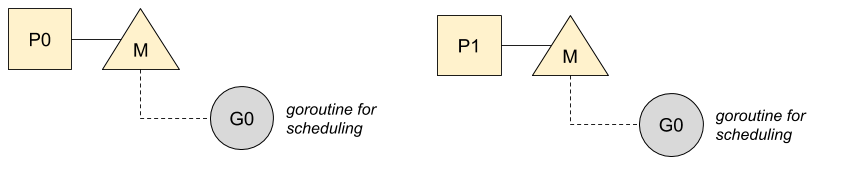
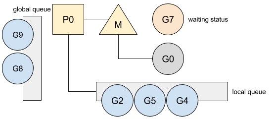
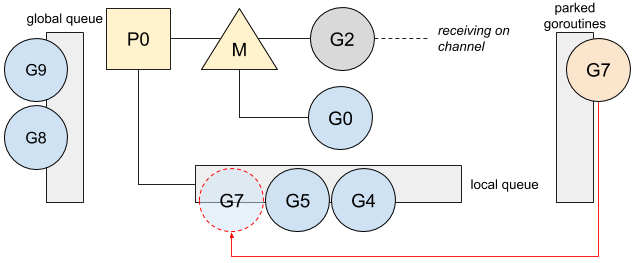

# Go: g0

ℹ️ *本文基于 Go 1.13*

在 Go 中创建的所有 Goroutine 都会被一个内部的调度器所管理。Go 调度器尝试为所有的 Goroutine 分配运行时间，并且在当前的 Goroutine 阻塞或者终止的时候，Go 调度器会通过运行 Goroutine 的方式使所有 CPU 保持忙碌状态。这个调度器实际上是作为一个特殊的 Goroutine 运行的。

## 调度 goroutine

Go 使用 `GOMAXPROCS` 变量限制同时运行的 OS 线程数量，这意味着 Go 必须对每个运行着的线程上的 Goroutine 进行调度和管理。这个调度的功能被委托给了一个叫做 `g0` 的特殊的 goroutine， g0 是为每个 OS 线程创建的第一个 goroutine：



之后，g0 会把就绪状态的 Goroutine 调度到线程上去运行。

我建议你阅读我的文章“ [Go: Goroutine, OS 线程及 CPU 管理](Go-Goroutine-OS-Thread-and-CPU-Management.md)”，来了解更多关于 `P`，`M`，`G` 模型的信息。

为了更好的理解 `g0` 的调度策略，来回顾下 channel 的用法。下面是一个 Goroutine 在向 channel 发送数据是阻塞的例子：

```go
ch := make(chan int)
[...]
ch <- v
```

当在 channel 上阻塞时，当前的 Goroutine 会被停放（ parked ），即处于等待状态（ waiting mode ），并且不会被放在任何 Goroutine 队列中：



之后，`g0` 会替换 Goroutine 并进行一轮调度：


本地队列在调度过程中具有优先级，2 号 Goroutine 会被运行：


我建议你阅读我的文章“ [Go: 调度器中的工作窃取 (Work-Stealing) ](Go-Work-Stealing-in-Go-Scheduler.md)” 来了解更多关于调度优先级的细节。

一旦有接收者读取 channel 中的数据，7 号 Goroutine 就会解除阻塞状态：

```go
v := <-ch
```

收到消息的 Goroutine 会切换到 `g0`，并且通过放入本地队列的方式将该 Goroutine 从停放状态解锁：



虽然这个特殊的 Goroutine 管理调度策略，但这并不是它唯一的工作，它还负责着更多的工作。

## 职责

与普通 Goroutine 不同的是，`g0` 有着固定且更大的栈，这使得在需要更大的栈的时候，以及栈不宜增长的时候，Go 可以进行操作。在 `g0` 的职责中，我们可以列出：

- Goroutine 创建。当调用 `go func(){ ... }()` 或 `go myFunction()` 时，Go 会在把它们放入本地队列前，将函数的创建委托给 `g0` 去做：


新创建的 Goroutine 优先运行，并且被放在本地队列的顶部。

建议阅读我的文章“[Go: 并发及调度器的亲合性原理](Go-Concurrency-And-Scheduler-Affinity.md)”了解更多关于 Goroutine 优先级的信息。

- defer 函数分配。
- 垃圾收集操作，比如 STW（ stopping the world ），扫描 Goroutine 的栈，以及一些标记清理操作。
- 栈增长。当需要的时候，Go 会增加 Goroutine 的大小。这个操作是由 `g0` 的 prolog 函数完成的。

这个特殊的 Goroutine 涉及许多其他操作（较大空间的对象分配，cgo 等），需要较大的栈来保证我们的程序进行更高效的管理操作，以保持程序的低内存打印效率。

---

via: https://medium.com/a-journey-with-go/go-g0-special-goroutine-8c778c6704d8

