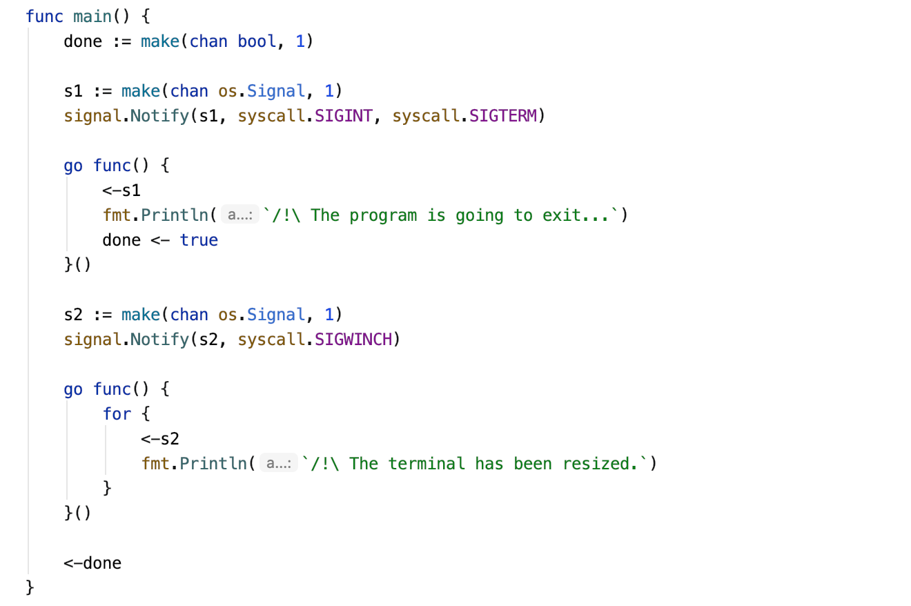
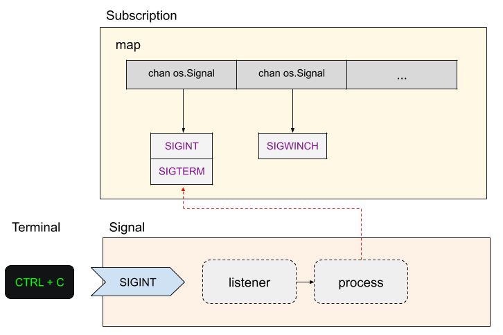
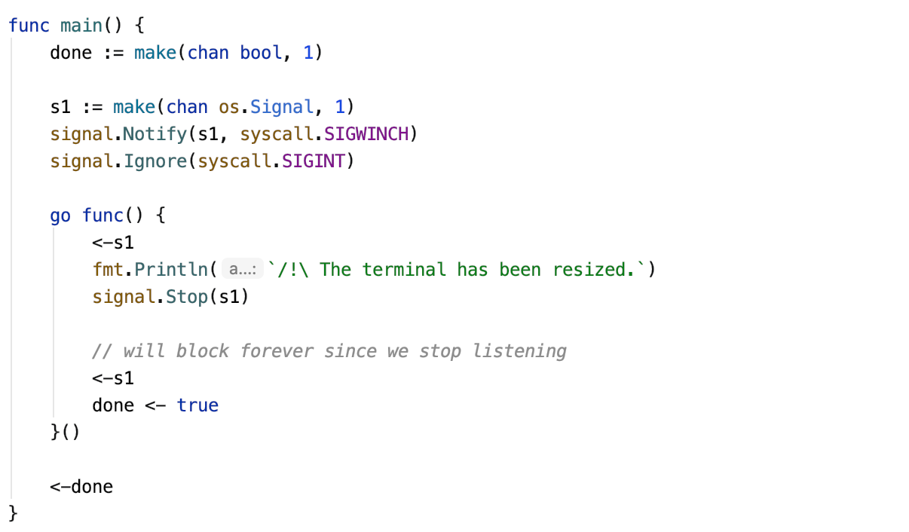
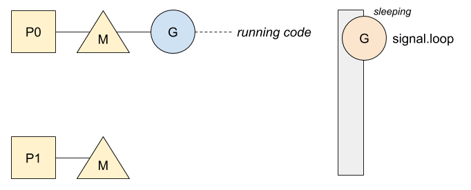
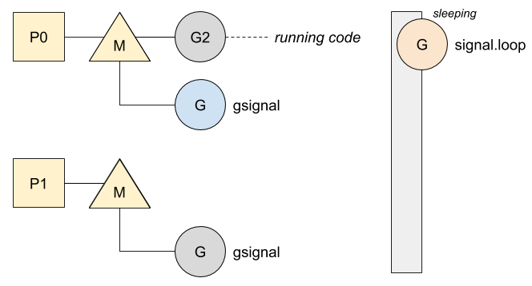
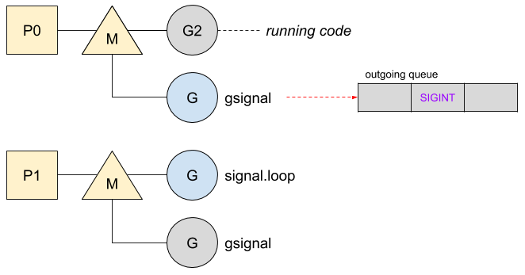
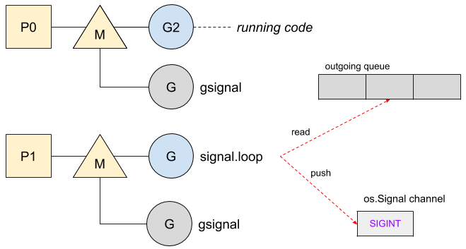
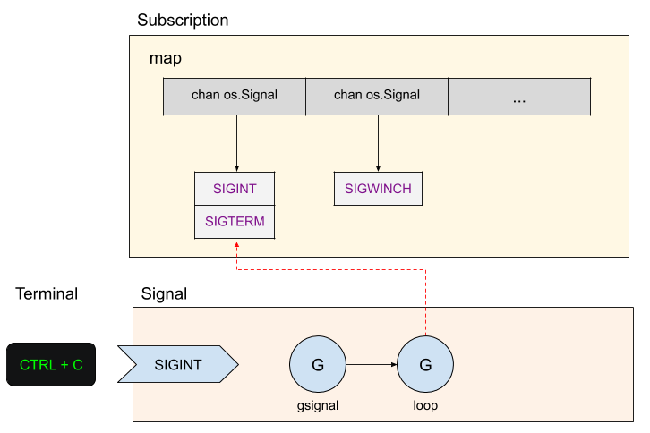

# Go: gsignal, 信号的掌控者

ℹ️ *本文基于 Go 1.13。*

`signal` 包提供了信号处理器，让我们的 Go 程序可以与发送来的信号进行交互。在进入内部细节之前，我们先来了解下 listener。

## 订阅

对信号的订阅是通过通道实现的。下面是一个监听所有中断信号和终端大小改变信号的程序的例子：

每个 `os.Signal` 通道监听各自对应的事件。下面是前面例子订阅工作流的示意图：

Go 也赋予了通道停止被通知的能力（`Stop(os.Signal)` 函数）和忽略信号的能力（`Ignore(...os.Signal)` 函数）。下面是两个函数的例子：

这个程序无法被 `CTRL + C` 中断，并且永远不会停止，因为在第二次从该通道接收信号之前，该通道已停止侦听终端调整大小的信号。现在我们来看下处理发送来的信号的 `listener` 和 `process` 两个阶段是如何内建的。

## gsignal

在初始化阶段，`signal` 开启了一个在循环中运行的协程，作为处理信号的消费者。在循环被通知激活之前，一直处于睡眠状态。下面是第一步的示意图：

然后，当一个信号到达程序时，信号处理器把它代理到一个名为 `gsignal` 的专用协程。这个协程是用比较大的栈空间（32 K，目的是满足不同操作系统的不同需求）创建的，并且空间固定不能增长。每个线程（图片的 `M`）内部都有 `gsignal` 协程来处理信号。下面是更新后的示意图：

`gsignal` 分析信号，检查信号是否可处理，在把信号发送到队列里时唤醒处于睡眠状态的协程。

*`SIGBUS` 或 `SIGFPE` 等同步信号不能被管理，会被转为 panic*

然后，循环中的协程可以处理它。它首先找到订阅了这个事件的通道，再把信号推进通道：

通过工具 `go tool trace` 可以可视化对循环处理信号的协程的追踪过程。

`gsignal` 的阻塞或锁会让信号处理陷入麻烦。由于它的栈空间固定，因此不能再申请内存。这就是在信号处理链中有两个独立的协程很重要的原因：一个协程用于在信号到达时尽快排列信号，另一个协程用循环处理该队列中的信号。

现在我们可以用新的组件来更新第一节的插图了：

