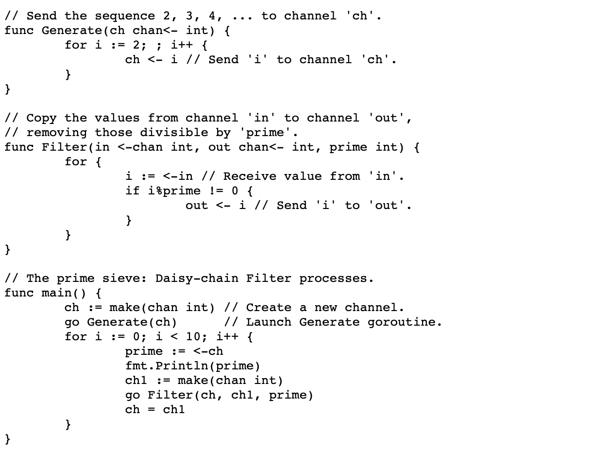

# Go: Goroutine 的回收

When: every goroutine exits
where: local and global list
who: Go
Why: save the cost
what: save the free goroutine

ℹ️ *本文基于 Go 1.13*

Goroutine 是很轻量的: 易于创建, 栈空间小, 上下文切换也很快捷. 这些轻量级属性, 也是许多开发者对其喜爱的原因. 然而即使 Goroutine 如此轻便, 但如果一段程序产生过多, 也会让他们变得不那么快捷轻便.

今天, 我们就来一起探讨下 Goroutine 的回收. 

## 生命周期
我们先通过一个例子, 理解下 goroutine 是如何被复用的. 我们就简单分析一段 Go Documentation 的计算质数代码为例: 


简单来说, 这段程序是用channel 来回传递中间结果, 过滤数列. 因此, 运行时 Go 需要创建和销毁很多承载运算的 goroutine.
那么 Go 是如何在运行时保证效率的呢? 
答案是, Go为每个 `P` 维护了一个本地可用 goroutine 列表: 


这样在使用和归还 goroutine的时候, 无需处理锁, 当 goroutine 退出后, 就会被直接归还到这个本地可用列表, 如下图所示: 


现在我们了解了每个 `P` 是如何管理可用goroutine的, 我们再来看调度器是均匀分布这些可用 goroutine 的呢? 
调度器通过维护两个全局列表实现分配: 分配栈可用列表 和 栈外可用列表. 如下图: 


由于全局列表可被多线程访问, 这里需要用到锁. 当处理器 `P` 的本地可用列表长度超过 64 后, 全局可用列表将接管这些可用 goroutine, 将本地可用列表的一半 goroutine 移动到全局列表: 


这个移动 goroutine 的过程涉及到内存的分配策略. 

## Requirements
回收机制节约了很多goroutine 分配成本. 不过, Go不会一直无限的存储这些退出的 goroutine. 如果列表超多一定大小(不如 2K), Go 就不会保存这些列表. 

我们通过上面质数计算的程序, 来分析一下 goroutine 回收机制到底为我们节约了多少运行成本: 

```bash
With recycling               Without recycling
name           time/op       name           time/op
PrimeNumber     12.7s ± 3%   PrimeNumber     12.1s ± 3%
PrimeNumber-8   2.27s ± 4%   PrimeNumber-8   2.13s ± 3%

name           alloc/op      name           alloc/op
PrimeNumber    1.83MB ± 0%   PrimeNumber    5.82MB ± 4%
PrimeNumber-8  1.52MB ± 7%   PrimeNumber-8  5.90MB ±21%
```
(Go 未提供关闭回收机制开关, 我是通过disable Go标准库中这个功能来实现的)
从benchmark 看, 这个回收机制帮我